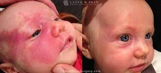

# pws-ai
Applying AI to predict PWS treatment's effect (as a photo)

# Project's scope:
## Background
PWS(Port-Wine Stains) is a birthmark in which swollen blood vessels create a reddish-purplish discoloration of the skin. 

### PWS Treatment:
* PWS is treated with use of laser. Patients attend multiple sessions, that have ussualy 1-3 months break in-between them
* PWS treatment most often doesn't fully remove PWS, but it makes it significantly better 
* PWS treatments takes from 1 to even 20 visits, ussualy around ~8. 
* We measure patient's improvement (treatment's efficacy) using a metric we've introduced in previous studies called GCE. GCE takes into account 2 variables: area of PWS & colour of PWS (colour improvement is a big part of PWS treatment)
* In our recent research, we've found that PWS worsens overtime when treatment is stopped. 
* More statistics to be provided

# Input Data
* Our input data are images of patients.
* We're focusing on patient's with PWS on head & neck  
* Currentely we've cleaned up data only for before 1st visit and after last visit (representing GCE min & GCE max)
* Can possibly also clean up data for other visits (not only last and first).
* Data is generated via taking 6 photos of patient(scanning machine) from 6 different angles. Data is then transformed to a 3d object (aka we can move patient's head around)

We've got three possible ways of using the data:
* Use the 6 source photos
* Use the 3d "object" (for lack of better words at 2am)
* Use the snapshots of 3d "object" (aka rotate the head 50 times by 1 angle and take a screenshot of what we see)

Furthermore, we're also given the GCE (measurement of absolute improvement) for each of the photos

We've got data of 56 patients. There are only 2-3 of those specific PWS laser & measuring machines in Poland, but further cooperation with respective clinics to get more data might be possible

# Task aim
We'd like to accompolish either of these:
* Predict how patient's PWS will improve at the end of the treatment (or after 1 session - but this is much harder, especially for later sessions which tend to be less effective). Ideally we'd like to have a great prediction, but even a rough prediction would be helpful for patients (perhaps generate a range of photos - as to how patient could possibly improve)
* Automate GCE metric generation based on the photo (less exciting, but also useful)

# Attack plan:
### Data pre-processing
As we're working with ANN, having the best possible input data, is the best way to ensure quality of our AI.
Therefore following have to be done/tried out:
* Data augmentation 
    * Typical imagining Data Augmentation methods, like noise, cropping, rotation etc.
    * (Infinite) many rotations of 3d images.
* Isolate patient's head & neck from their clothes 
* Underline PWS with imagining methods (make it stand out more compared to rest of the body, or do the opposite - make rest of the body *grayer*)

### Training AI
To mind come 2 following AIs:
* GANs
* CNNs

### Testing
Test on un-seen data. Possible further tests offline in real life case scenario